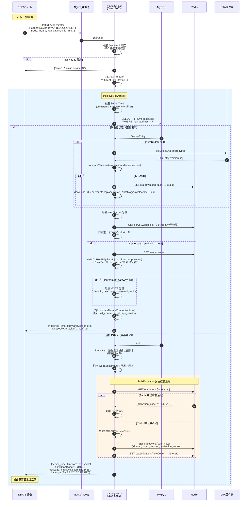
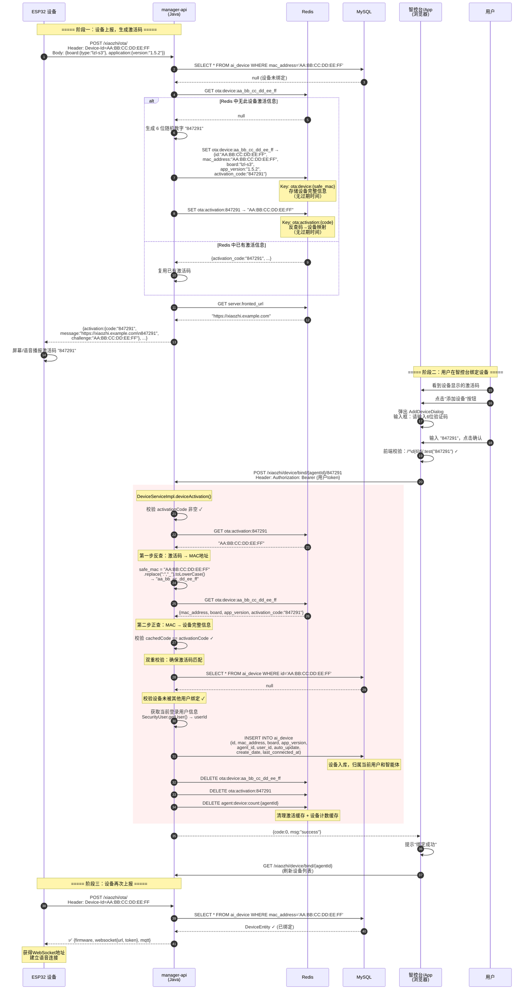
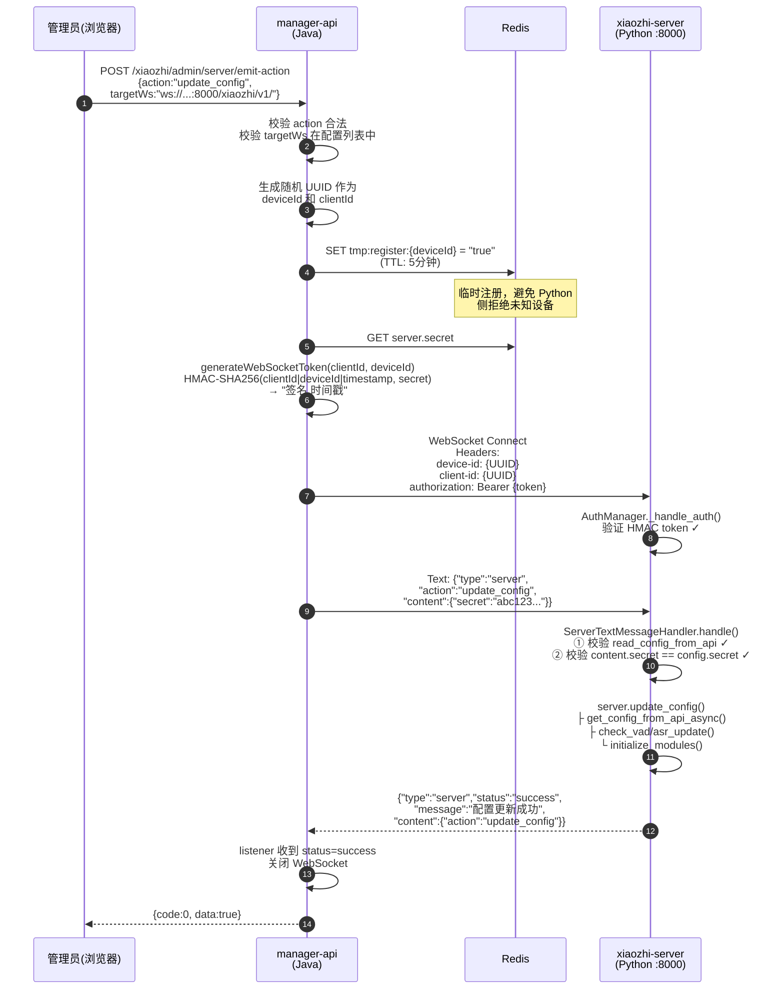
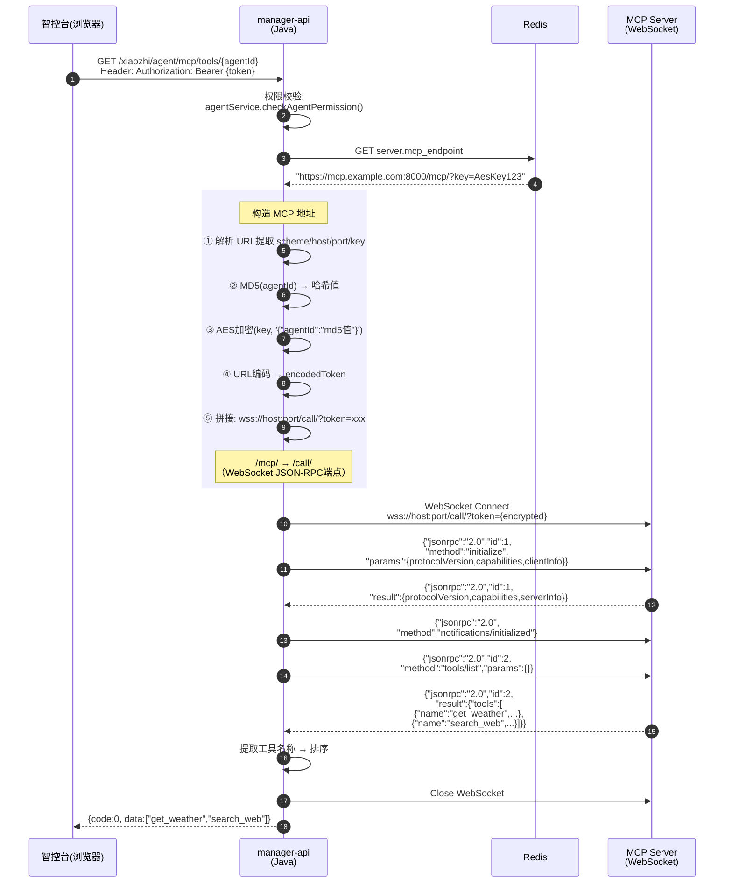

# 三条关键流程深入解析

## 一、OTA 上报完整流程

### 1.1 什么是 OTA 上报？

ESP32 设备每次开机或重启时，会向服务端发送一个 HTTP POST 请求，上报自己的硬件信息（MAC地址、固件版本、芯片型号等）。服务端根据这些信息：
- 判断设备是否已被用户绑定
- 已绑定：返回 WebSocket 连接地址 + token + 最新固件下载地址
- 未绑定：生成6位激活码，让用户在智控台输入来绑定设备

### 1.2 OTA 上报时序图



### 1.3 请求格式

```
POST http://<host>:8002/xiaozhi/ota/
Headers:
  Device-Id: AA:BB:CC:DD:EE:FF     # 设备MAC地址（必填）
  Client-Id: AA:BB:CC:DD:EE:FF     # 客户端标识（可选，默认等于Device-Id）

Body (JSON): {
  "version": 1,
  "flash_size": 4194304,
  "mac_address": "AA:BB:CC:DD:EE:FF",
  "chip_model_name": "ESP32-S3",
  "chip_info": { "model": 9, "cores": 2, "revision": 2, "features": 18 },
  "application": {
    "name": "xiaozhi",
    "version": "1.5.2",
    "compile_time": "2024-01-01T00:00:00",
    "idf_version": "v5.3"
  },
  "board": {
    "type": "lzl-s3",
    "ssid": "MyWiFi", "rssi": -45, "ip": "192.168.1.100"
  }
}
```

### 1.4 服务端处理流程（代码级别）

```
OTAController.checkOTAVersion()
│
├── 1. 校验 Device-Id 非空，MAC 格式有效（正则：^([0-9A-Za-z]{2}[:-]){5}([0-9A-Za-z]{2})$）
│
├── 2. 若 Client-Id 为空，令 Client-Id = Device-Id
│
└── 3. DeviceServiceImpl.checkDeviceActive(macAddress, clientId, deviceReport)
    │
    ├── 4. 构造 response，设置 server_time（时间戳+时区+偏移量）
    │
    ├── 5. getDeviceByMacAddress(macAddress)  →  查 ai_device 表
    │   │
    │   ├── 返回 null （设备未绑定）:
    │   │   ├── firmware = 原样返回设备上报的版本（兼容旧固件）
    │   │   └── → 跳到步骤 9 生成激活码
    │   │
    │   └── 返回 DeviceEntity （设备已绑定）:
    │       └── 若 autoUpdate != 0:
    │           └── → 步骤 6 检查固件升级
    │
    ├── 6. buildFirmwareInfo(board.type, application.version)
    │   ├── otaService.getLatestOta(type)  →  按板子类型查最新固件
    │   ├── compareVersions(ota.version, currentVersion)
    │   ├── 若有新版本:
    │   │   ├── 生成 UUID → Redis: ota:download:{uuid} → ota.id
    │   │   └── downloadUrl = server.ota 参数中的URL
    │   │       .replace("/ota/", "/otaMag/download/") + uuid
    │   └── 返回 Firmware { version, url }
    │
    ├── 7. 组装 WebSocket 配置
    │   ├── 从系统参数取 server.websocket（可配多个，分号分隔）
    │   ├── 随机选一个 URL（负载均衡）
    │   ├── 若 server.auth_enabled == "true":
    │   │   └── generateWebSocketToken(clientId, macAddress)
    │   │       ├── 取 server.secret 作为 HMAC 密钥
    │   │       ├── 签名内容 = "{clientId}|{macAddress}|{timestamp}"
    │   │       ├── HMAC-SHA256 签名 → Base64 URL-safe 编码（无填充）
    │   │       └── token = "{signature}.{timestamp}"
    │   └── 设置 websocket.url 和 websocket.token
    │
    ├── 8. 组装 MQTT 配置（若 server.mqtt_gateway 有值）
    │   ├── client_id = "{groupId}@@@{mac}@@@{mac}"（冒号替换为下划线）
    │   ├── username = Base64(JSON{ip: 客户端IP})
    │   ├── password = HMAC-SHA256(client_id|username, mqtt_signature_key)
    │   ├── publish_topic = "device-server"
    │   └── subscribe_topic = "devices/p2p/{mac}"
    │
    ├── 9. 若设备已绑定:
    │   └── 异步更新 last_connected_at 和 app_version
    │
    └── 10. 若设备未绑定 → buildActivation(macAddress, deviceReport)
        ├── 检查 Redis 中是否已有该设备的激活码
        │   ├── 有 → 直接返回已有的激活码
        │   └── 无 → 生成新的 6 位数字激活码
        ├── Redis 存储两个 key（无过期时间）：
        │   ├── ota:device:{safe_mac} → {id, mac, board, version, activation_code}
        │   └── ota:activation:{code} → deviceId (MAC地址)
        └── 返回 Activation {
              code: "123456",
              message: "https://xiaozhi.example.com\n123456",
              challenge: "AA:BB:CC:DD:EE:FF"
            }
```

### 1.5 响应格式

**已绑定设备的响应**：
```json
{
  "server_time": {
    "timestamp": 1713580800000,
    "timeZone": "Asia/Shanghai",
    "timezone_offset": 480
  },
  "firmware": {
    "version": "1.6.0",
    "url": "https://ota.example.com/xiaozhi/otaMag/download/550e8400-e29b..."
  },
  "websocket": {
    "url": "ws://192.168.1.10:8000/xiaozhi/v1/",
    "token": "dGhpcyBpcyBhIHRlc3Q.1713580800"
  },
  "mqtt": {
    "endpoint": "mqtt.example.com:1883",
    "client_id": "GID_default@@@AA_BB_CC_DD_EE_FF@@@AA_BB_CC_DD_EE_FF",
    "username": "eyJpcCI6IjE5Mi4xNjguMS4xIn0=",
    "password": "HMAC签名...",
    "publish_topic": "device-server",
    "subscribe_topic": "devices/p2p/AA_BB_CC_DD_EE_FF"
  }
}
```

**未绑定设备的响应**：
```json
{
  "server_time": { "timestamp": 1713580800000, "timeZone": "Asia/Shanghai", "timezone_offset": 480 },
  "firmware": {
    "version": "1.5.2",
    "url": "https://xiaozhi.server.com/xiaozhi/ota/"
  },
  "websocket": { "url": "ws://192.168.1.10:8000/xiaozhi/v1/", "token": "..." },
  "activation": {
    "code": "123456",
    "message": "https://xiaozhi.example.com\n123456",
    "challenge": "AA:BB:CC:DD:EE:FF"
  }
}
```

---

## 二、激活码绑定设备 完整流程

### 2.1 流程概述

当 ESP32 设备首次上报时，服务端在 Redis 中生成 6 位激活码。用户需要在**智控台**或**手机 App** 中输入这个激活码，将设备绑定到自己的智能体下。绑定成功后，设备下次 OTA 上报就能获得正确的连接配置。

### 2.2 激活码绑定时序图



### 2.3 Redis 中的数据结构

激活码在 Redis 中使用**两个 key 互相反查**：

| Redis Key | 值 | 用途 |
|-----------|-----|------|
| `ota:device:{safe_mac}` | `{id, mac_address, board, app_version, activation_code}` | 用 MAC 地址查设备信息和激活码 |
| `ota:activation:{code}` | `"AA:BB:CC:DD:EE:FF"` (MAC地址) | 用激活码反查 MAC 地址 |

其中 `{safe_mac}` = MAC 地址中冒号替换为下划线并转小写，例如 `AA:BB:CC:DD:EE:FF` → `aa_bb_cc_dd_ee_ff`。

**注意**：这两个 key **没有设置过期时间**。设备每次重启 OTA 上报时，如果 Redis 中已有该设备的激活信息，会复用已有的激活码而不是生成新的。

### 2.4 绑定校验的五道关卡

`DeviceServiceImpl.deviceActivation()` 方法中对绑定请求进行了严格校验：

| 序号  | 校验内容                                                   | 失败结果                                |
| --- | ------------------------------------------------------ | ----------------------------------- |
| 1   | activationCode 非空                                      | 抛出 `ACTIVATION_CODE_EMPTY`          |
| 2   | Redis `ota:activation:{code}` 存在                       | 抛出 `ACTIVATION_CODE_ERROR`（激活码不存在）  |
| 3   | Redis `ota:device:{safe_mac}` 存在且 `activation_code` 匹配 | 抛出 `ACTIVATION_CODE_ERROR`（数据不一致）   |
| 4   | `ai_device` 表中该设备 ID 不存在                               | 抛出 `DEVICE_ALREADY_ACTIVATED`（已被绑定） |
| 5   | 当前用户已登录（`SecurityUser.getUser()` 非空）                   | 抛出 `USER_NOT_LOGIN`                 |

### 2.5 前端调用方式

**Web 端** (`AddDeviceDialog.vue`)：
- 弹窗组件，包含一个输入框要求输入 6 位数字验证码
- 前端正则校验 `/^\d{6}$/`
- 调用 `Api.device.bindDevice(agentId, deviceCode, callback)`
- 实际请求：`POST /xiaozhi/device/bind/{agentId}/{deviceCode}`

**Mobile 端** (`pages/device/index.vue`)：
- 使用 uni-app 的 `uni.showModal` 弹出输入框
- 调用 `bindDevice(agentId, code)` 
- 实际请求：`POST /xiaozhi/device/bind/{agentId}/{code}`

### 2.6 手动添加设备（另一种绑定方式）

除了激活码绑定，智控台还支持**手动添加设备**（适用于无法 OTA 上报的场景）：

```
POST /xiaozhi/device/manual-add
Body: { macAddress, agentId, board, appVersion }
```

此方式跳过 Redis 激活码流程，直接在 `ai_device` 表中创建记录。要求 MAC 地址在系统中不重复。

---

## 三、manager-api → Python WebSocket 管理指令流程

### 3.1 什么是管理指令？

当管理员在智控台修改了模型配置、系统参数等，需要通知正在运行的 Python 核心服务**热更新配置**，而不需要重启。这通过 Java 管理端**主动建立 WebSocket 连接到 Python 服务**来实现。

### 3.2 管理指令时序图



### 3.3 关键点解释

**为什么 Java 要先在 Redis 写临时注册？**

因为 Python 端收到 WebSocket 连接后，会尝试用 `device-id` 去 manager-api 查设备信息。如果找不到设备会断开连接。临时注册让 Python 侧知道这是一个合法的管理连接。

**为什么有两层密钥校验？**

1. **第一层**：WebSocket 握手时的 HMAC token（`authorization` header），由 Python 的 `AuthManager` 验证 — 确保连接者持有 `server.secret`
2. **第二层**：消息体里的 `content.secret`，由 Python 的 `ServerTextMessageHandler` 验证 — 确保发送管理指令的人也持有 `manager-api.secret`

两个 secret 实际上是同一个值（`server.secret` = `manager-api.secret`），但校验发生在不同层级，提供纵深防护。

**Java 端用的 WebSocketClientManager 是什么？**

是一个封装好的 WebSocket 客户端工具类，支持 `try-with-resources` 自动关闭、消息队列、同步等待响应（`listener` 方法轮询直到 predicate 返回 true 或超时）。

---

## 四、MCP 端点工具发现流程

### 4.1 什么是 MCP 端点工具发现？

MCP (Model Context Protocol) 是一种让 AI 模型能调用外部工具的协议。智控台需要展示某个智能体可用的 MCP 工具列表，为此需要连接 MCP 服务端点，通过 JSON-RPC 协议获取工具列表。

### 4.2 MCP 工具发现时序图



### 4.3 MCP 端点地址构造详解

系统参数 `server.mcp_endpoint` 存储的是 HTTP 格式的 MCP 地址，例如：
```
https://mcp.example.com:8000/mcp/?key=AES密钥字符串
```

地址构造过程：
```
原始: https://mcp.example.com:8000/mcp/?key=MyAesKey123

① 提取协议 → https → 转换为 wss（http→ws, https→wss）
② 提取路径 → //mcp.example.com:8000/mcp
③ 取最后一个/之前 → //mcp.example.com:8000
④ 提取密钥 → key=后面的值 → "MyAesKey123"

⑤ 对智能体ID加密生成 token:
   ├── MD5(agentId) → 得到哈希值
   ├── 构造JSON: {"agentId": "{md5值}"}
   └── AES加密(key, json) → encryptToken
   └── URL编码(encryptToken) → encodedToken

⑥ 最终 MCP 地址:
   wss://mcp.example.com:8000/mcp/?token={encodedToken}
   → 替换 /mcp/ 为 /call/:
   wss://mcp.example.com:8000/call/?token={encodedToken}
```

### 4.4 关键点解释

**为什么用 AES 加密 token 而不是简单的参数传递？**

MCP 端点 URL 中的 token 携带了智能体身份信息。AES 加密确保只有持有密钥的服务才能构造有效的 token，防止未授权访问其他智能体的工具。

**为什么要对 agentId 先做 MD5？**

MD5 是固定 32 字符长度，作为 AES 加密输入可以确保加密后的 token 长度可控且不泄露原始 agentId。

**/mcp/ 和 /call/ 有什么区别？**

- `/mcp/` 是 MCP 标准的 SSE (Server-Sent Events) 端点，主要用于客户端长连接
- `/call/` 是 WebSocket 端点，支持双向 JSON-RPC 通信，更适合管理端的短连接查询场景

**三步握手的意义？**

JSON-RPC 协议要求：
1. `initialize` → 协商协议版本和能力
2. `notifications/initialized` → 确认初始化完成
3. `tools/list` → 正式业务请求

这是 MCP 协议规范要求的标准握手流程。
