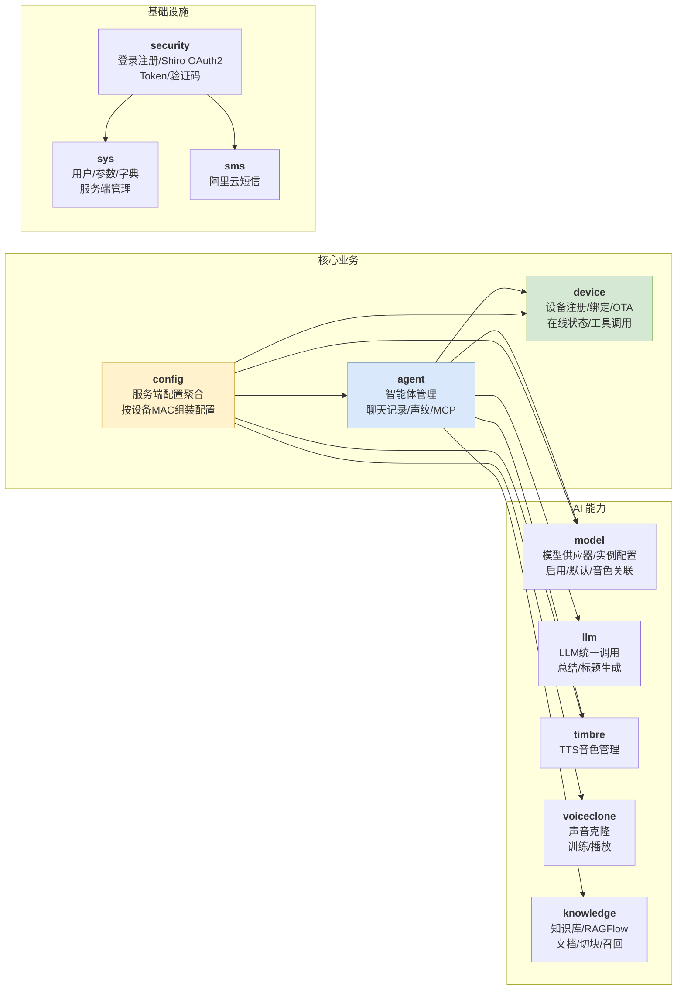
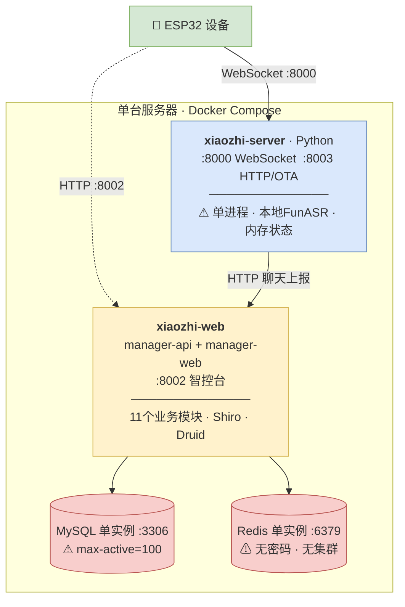
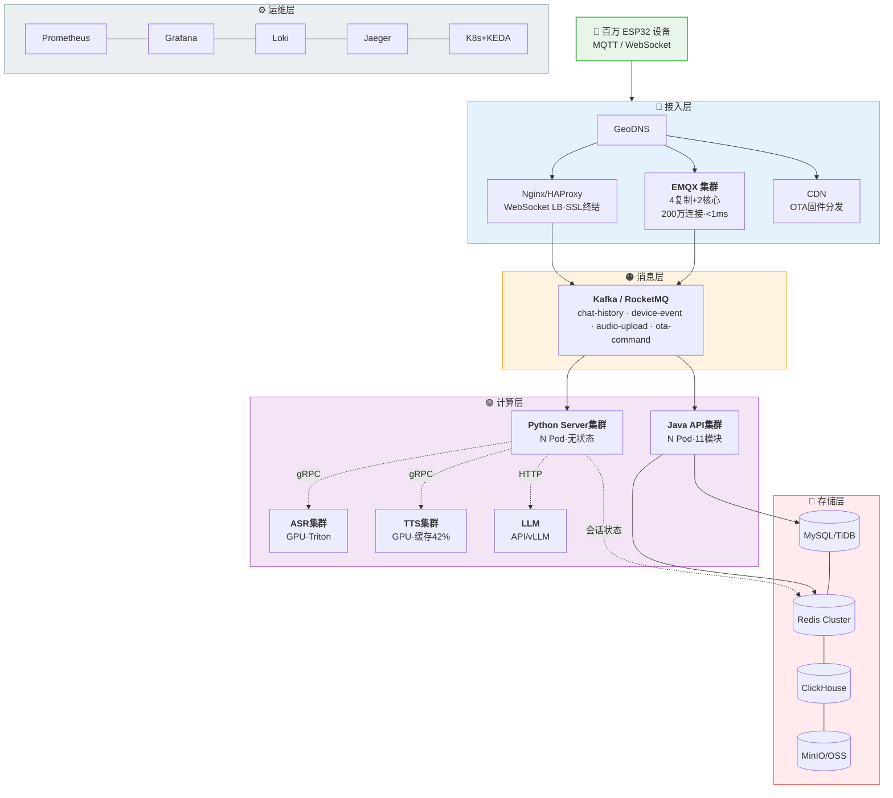
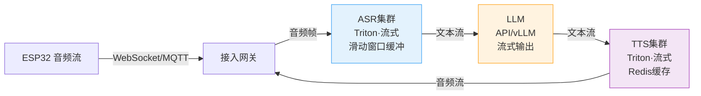
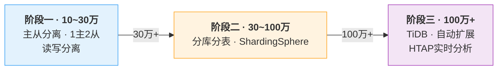
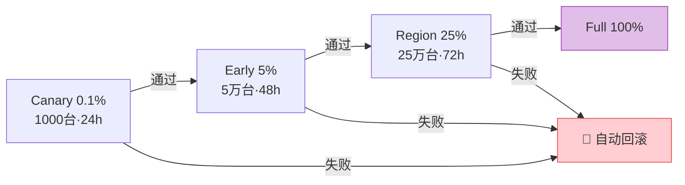
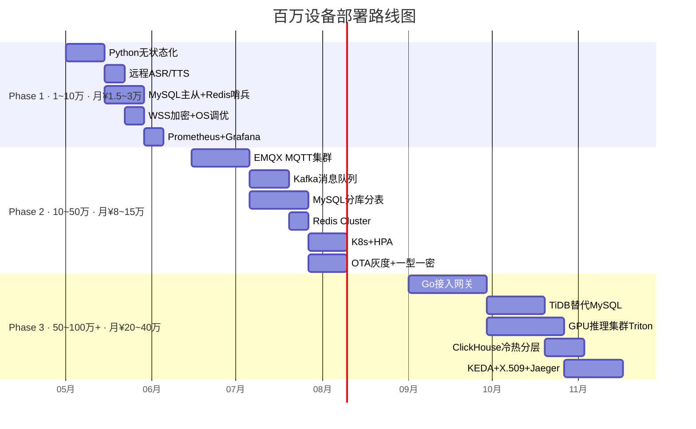

# 小智 ESP32 Server —— 百万设备部署架构方案

> **调研日期**：2026-04-20
> **目标**：将 xiaozhi-esp32-server 从单机部署扩展至支撑 **100万+** 设备并发接入
> **方法**：借鉴 DeerFlow 深度研究框架，对接入/计算/存储/消息/编排/安全/可观测 7 大维度进行搜索 + 源码分析 + 行业对标
> **drawio 精细图**：`diagrams/` 目录下可用 VS Code drawio 插件打开编辑

[TOC]

---

## 一、当前系统分析

### 1.1 modules 模块功能全景

manager-api 共 **11 个业务模块**，理解各模块职责才能精准定位扩展瓶颈：



### 1.2 各模块详细说明

| 模块 | 核心功能 | 关键 API | 百万级瓶颈点 |
|------|---------|---------|:----------:|
| **agent** | 智能体 CRUD、聊天记录上报与存储、声纹管理、MCP 接入、标签系统 | `/agent/list`、`/agent/chat-history/report`、`/agent/{id}/sessions` | 聊天上报写入量 |
| **device** | 设备注册(6位码)、绑定/解绑、在线状态、OTA版本检查、工具调用转发 | `/device/register`、`/device/bind`、`/ota/`、`/otaMag/upload` | 设备连接与OTA |
| **config** | 为 Python 服务端组装运行配置，按 MAC 解析已选模型 | `/config/server-base`、`/config/agent-models` | 频繁配置读取 |
| **model** | 模型供应器(Provider)与实例配置管理、启用/默认切换、音色关联 | `/models/list`、`/models/{type}/{code}`、`/models/{id}/voices` | 无明显瓶颈 |
| **llm** | 统一 LLM 调用封装（OpenAI 风格），用于聊天总结和标题生成 | 无 REST（内部 Service） | LLM 并发 |
| **timbre** | TTS 音色 CRUD，为智能体提供可选音色列表 | `/ttsVoice/` | 无明显瓶颈 |
| **voiceclone** | 声音克隆记录管理、上传训练音频、触发复刻 | `/voiceClone/upload`、`/voiceClone/cloneAudio` | 音频存储 |
| **knowledge** | 对接 RAGFlow，知识库/文档上传/解析/切块/召回测试 | `/datasets/`、`/datasets/{id}/documents`、`/datasets/{id}/retrieval-test` | RAG 查询性能 |
| **security** | 登录注册、图形/短信验证码、Shiro OAuth2 Token 签发 | `/user/login`、`/user/register`、`/user/captcha` | Token 验证 |
| **sys** | 系统用户管理、参数键值(含缓存)、数据字典、WebSocket 服务端管理 | `/admin/users`、`/admin/params`、`/admin/server/emit-action` | 参数缓存 |
| **sms** | 阿里云短信发送验证码封装 | 无 REST（内部 Service） | 无明显瓶颈 |

### 1.3 现有部署拓扑



### 1.4 瓶颈量化

| 瓶颈 | 当前能力 | 百万需求 | 差距 |
|:----:|---------|:-------:|:----:|
| WebSocket 连接 | 单进程 ~3万 | 100万 | **30~100x** |
| ASR/TTS | 本地单实例 ~100 并发 | 10万+ | **1000x** |
| MySQL 写入 | 连接池100 | 数万/秒 | **100x** |
| Redis | 单实例无密码 | 百万级/秒 | **100x** |
| 聊天上报 (`/agent/chat-history/report`) | 同步HTTP→MySQL | 异步削峰 | 架构改变 |
| OTA (`/ota/`) | 单机HTTP | CDN+灰度 | 架构改变 |
| 监控 | 无 | 全链路 | 从0到1 |

---

## 二、目标架构

### 2.1 全景图



### 2.2 设计原则

| 原则 | 说明 |
|:----:|------|
| 无状态化 | 服务无本地状态，会话存Redis |
| 异步解耦 | 设备消息→MQ→消费者 |
| 水平扩展 | 每层独立增加节点 |
| 最终一致 | 聊天记录秒级延迟换吞吐 |
| 故障隔离 | 熔断+限流 |
| 渐进演进 | 3阶段实施 |

---

## 三、分层改造方案

### 3.1 接入层

#### 方案对比

| 维度 | A：Python多实例 | B：EMQX集群 | C：Go网关 |
|:----:|:--------------:|:----------:|:--------:|
| 改造量 | 小 | 中 | 大 |
| 单实例连接 | ~3万 | ~50万/节点 | ~10~50万 |
| 百万节点数 | ~34个 | 4+2 | 3~10 |
| 语音流 | 直接处理 | MQTT+UDP | gRPC转发 |
| 生产验证 | 一般 | **EMQX200万** | 社区方案 |

#### 方案A：Python多实例+Nginx

```nginx
upstream xiaozhi_ws {
    ip_hash;
    server python-server-1:8000;
    server python-server-2:8000;
    server python-server-3:8000;
}
server {
    listen 443 ssl;
    location /ws {
        proxy_pass http://xiaozhi_ws;
        proxy_http_version 1.1;
        proxy_set_header Upgrade $websocket;
        proxy_set_header Connection "upgrade";
        proxy_read_timeout 86400s;
    }
}
```

关键改造：`Dialogue`对象→Redis；本地ASR→远程；每实例~3万连接

#### 方案B：EMQX MQTT集群（推荐）

> **EMQX实测**：单节点500万+连接，集群1亿连接，千万TPS，端到端延迟<1ms。
> **2026新方向**：MQTT over QUIC协议——0-RTT快速重连、多路复用消除队头阻塞、网络切换无缝保持连接。

```
协议变更：ESP32 → MQTT → EMQX → Kafka → Python Consumer
```

EMQX核心-复制架构：复制节点无状态（50万/节点），核心节点管路由（CPU仅1%）

#### 方案C：Go网关

> **社区实现**：`hackers365/xiaozhi-esp32-server-golang`
> **生产经验**：goroutine~2KB/个，**关键优化**：非阻塞发送+消息合并（slow consumer 200K×256buf=51GB OOM，需ruthless drop策略）

#### 推荐策略

| 阶段 | 方案 | 理由 |
|:----:|------|------|
| <10万 | A | 改造最小 |
| 10~100万 | B | EMQX成熟验证 |
| >100万 | B+C | Go解析+EMQX路由 |

---

### 3.2 计算层：语音流水线

#### 延迟预算（行业标准）

> **目标**：端到端 < 800ms 以保证自然对话体验

| 环节 | 预算 | 优化手段 |
|------|:----:|---------|
| STT (ASR) | 200~350ms | 流式识别、Triton动态批处理 |
| LLM 首字(TTFT) | 100~200ms | 流式输出、vLLM/TGI |
| TTS 首字节(TTFB) | 75~150ms | 流式合成、缓存42%命中 |
| 网络+编排 | 50~100ms | gRPC、零拷贝 |
| **总计** | **<800ms** | 流式并行（非串行3s+） |

#### GPU推理集群（Triton）

| 设备规模 | ASR节点 | TTS节点 | GPU | 并发 |
|:--------:|:------:|:------:|:---:|:----:|
| 10万 | 2~4 | 2~4 | RTX 4090 | ~1万 |
| 50万 | 8~16 | 8~16 | A100 40G | ~5万 |
| 100万 | 20~40 | 20~40 | A100 80G | ~10万 |

关键特性：动态批处理、TensorRT加速(延迟-50%)、FP16/INT8量化(速度2~4x)

#### 生产架构



---

### 3.3 消息层

#### 关键数据：百万设备写入压力

假设10%设备同时对话，每次10轮 = **100万条/分钟**。当前同步链路：`/agent/chat-history/report` → HTTP → MySQL INSERT 必然崩溃。

#### 选型

| 维度 | Kafka | RocketMQ |
|:----:|:-----:|:--------:|
| 吞吐 | 百万TPS+ | 百万TPS |
| 运维 | 中 | **低** |
| 国内生态 | 好 | **最好** |
| 推荐 | 生态首选 | **运维首选** |

#### Topic规划（结合modules分析）

| Topic | 生产者 | 消费者 | 对应模块 |
|-------|:------:|:-----:|---------|
| `chat-history` | Python | Java(AgentChatHistoryBizService) | agent |
| `device-event` | Python | Java(DeviceService) | device |
| `device-metrics` | Python | 监控 | sys |
| `ota-command` | Java(OtaService) | OTA服务 | device |
| `audio-upload` | Python | 音频服务(AgentChatAudioService) | agent |

---

### 3.4 存储层

#### MySQL演进



> **TiDB 2026优势**：MySQL兼容、自动水平分片（无需应用层sharding）、TiFlash列存实时分析（免ETL）、Multi-Raft强一致

**分片策略（阶段二）**：

| 表（agent模块） | 分片键 | 分片数 |
|-------|:------:|:------:|
| `ai_agent_chat_history` | device_id | 16 |
| `ai_agent_chat_audio` | device_id | 8 |
| `ai_device` (device模块) | id | 4 |

#### Redis集群化

当前→目标：单实例无密码 → **Redis Cluster 3主3从**

```yaml
spring:
  data:
    redis:
      cluster:
        nodes: [redis-1:6379, redis-2:6379, redis-3:6379,
                redis-4:6379, redis-5:6379, redis-6:6379]
      password: <strong-password>
      lettuce:
        pool: { max-active: 200, max-idle: 50, min-idle: 10 }
```

#### 冷热分层

| 层级 | 时间 | 存储 | 响应 |
|:----:|:----:|------|:----:|
| 热 | 30天 | MySQL+Redis | <5ms |
| 温 | 30~180天 | ClickHouse | <1s |
| 冷 | 180天+ | OSS(Parquet) | 按需 |

迁移：Debezium/TiCDC → Kafka → ClickHouse/OSS

---

### 3.5 服务层+编排层

#### manager-api调优

| 配置 | 当前 | 建议 |
|------|:----:|:----:|
| druid.max-active | 100 | 200 |
| druid.initial-size | 10 | 20 |

**各模块异步化改造**：

| 模块·接口 | 当前 | 改造后 |
|-----------|------|--------|
| agent · 聊天上报 | HTTP同步写MySQL | Kafka Consumer批量写 |
| agent · 语音文件 | 本地磁盘 | 异步MinIO/OSS |
| device · 状态更新 | 直接UPDATE | Redis+定时同步 |
| device · OTA通知 | 同步推送 | Kafka+分批异步 |
| voiceclone · 训练音频 | 本地存储 | OSS+CDN |

#### K8s Namespace

| Namespace | 模块 |
|-----------|------|
| `xiaozhi-ingestion` | Python Server / Go Gateway |
| `xiaozhi-processing` | ASR / TTS / LLM |
| `xiaozhi-api` | manager-api (11模块) |
| `xiaozhi-messaging` | Kafka |
| `xiaozhi-storage` | MySQL / Redis / ClickHouse |
| `xiaozhi-monitoring` | Prometheus / Grafana / Loki |

#### 自动伸缩

| 方式 | 适用 | 触发 |
|------|------|------|
| **HPA** | API/Python | CPU>70% |
| **KEDA** | Kafka Consumer | 积压>1000 |

```yaml
apiVersion: autoscaling/v2
kind: HorizontalPodAutoscaler
metadata:
  name: manager-api-hpa
spec:
  scaleTargetRef: { apiVersion: apps/v1, kind: Deployment, name: manager-api }
  minReplicas: 3
  maxReplicas: 20
  metrics:
    - type: Resource
      resource: { name: cpu, target: { type: Utilization, averageUtilization: 70 } }
```

---

## 四、安全·OTA·可观测

### 4.1 安全

**传输**（Phase1）：所有连接TLS 1.2+，Nginx/EMQX做SSL终结

**认证**：

| 方案 | 安全级别 | 阶段 |
|------|:-------:|:----:|
| 一型一密 | 中 | Phase2 |
| X.509 mTLS | 最高 | Phase3 |
| 设备指纹 | 高 | Phase3 |

**限流**：单设备≤10连接/min、单IP≤100/min、全局≤1000/s

### 4.2 OTA灰度

**分层版本**（互不影响）：Firmware(v2.3.1) / Model(v1.2.0) / Config(v1.0.5)



### 4.3 可观测

| 支柱 | 工具 | 作用 |
|:----:|------|------|
| Metrics | Prometheus+Grafana | 指标可视化 |
| Logs | Loki+Promtail | 日志聚合 |
| Traces | Jaeger+OpenTelemetry | 全链路追踪(5~10x效率) |

**告警**：P0(电话)服务宕机 → P1(钉钉)错误>1% → P2 CPU>80% → P3 邮件

---

## 五、实施路线与成本

### 5.1 路线图



### 5.2 各阶段关键任务

#### Phase 1：1~10万（4~6周）

| 任务 | 优先级 | 涉及模块 |
|------|:-----:|---------|
| Python无状态化(Dialogue→Redis) | **P0** | - |
| 远程ASR/TTS | **P0** | - |
| OS参数调优(sysctl+ulimit) | **P0** | - |
| MySQL主从 | P1 | 全模块 |
| Redis哨兵+密码 | P1 | security, sys, config |
| WSS加密 | P1 | device |
| Prometheus+Grafana | P1 | - |

#### Phase 2：10~50万（8~12周）

| 任务 | 优先级 | 涉及模块 |
|------|:-----:|---------|
| EMQX MQTT集群 | **P2** | device |
| Kafka消息队列 | P1 | agent(聊天上报), device(事件) |
| MySQL分库分表 | P2 | agent, device |
| Redis Cluster | P1 | security, config, sys |
| K8s+HPA | P2 | 全模块 |
| OTA灰度 | P2 | device(OTA) |
| 一型一密认证 | P2 | device, security |

#### Phase 3：50~100万+（12~16周）

| 任务 | 优先级 | 涉及模块 |
|------|:-----:|---------|
| Go接入网关 | P3 | - |
| TiDB | P3 | 全模块(免sharding) |
| GPU推理集群 | P3 | - |
| ClickHouse冷热分层 | P3 | agent(聊天历史) |
| KEDA事件驱动 | P3 | agent, device消费者 |
| X.509证书 | P3 | device, security |
| Jaeger全链路 | P3 | 全模块 |

### 5.3 成本

| 阶段 | 设备规模 | 月成本 | 关键开支 |
|:----:|:-------:|:------:|---------|
| Phase 1 | 10万 | ¥1.5~3万 | 4×Python(4核8G) + 2×Java + RDS主从 + 远程ASR API |
| Phase 2 | 50万 | ¥8~15万 | EMQX 6节点 + 8×A10 GPU + Kafka 3节点 + K8s |
| Phase 3 | 100万+ | ¥20~40万 | 取决于GPU规模和LLM选择(API比自建省50%+) |

### 5.4 优先级总表

| 优先级 | 改造项 | 复杂度 | 效果 |
|:------:|--------|:-----:|------|
| **P0** | Python无状态化 | 中 | 1万→10万 |
| **P0** | 远程ASR/TTS | 中 | 解除AI瓶颈 |
| **P0** | OS调优 | 低 | 连接10x |
| P1 | MySQL主从 | 中 | 写入3~5x |
| P1 | Redis Cluster | 低 | 读写10x |
| P1 | Kafka | 中 | 削峰解耦 |
| P1 | WSS/MQTTS | 低 | 安全基线 |
| P2 | EMQX集群 | 高 | 10万→100万 |
| P2 | K8s+HPA | 高 | 弹性扩缩 |
| P2 | OTA灰度 | 中 | 风险控制 |
| P3 | TiDB | 高 | 50万→百万 |
| P3 | Go网关 | 高 | 极致性能 |
| P3 | Triton GPU | 高 | AI极致扩展 |

---

## 附录

### A. 操作系统调优

```bash
# /etc/sysctl.conf
fs.file-max = 2097152
fs.nr_open = 2097152
net.core.somaxconn = 65535
net.ipv4.tcp_max_syn_backlog = 65535
net.ipv4.ip_local_port_range = 1024 65535
net.ipv4.tcp_tw_reuse = 1
net.ipv4.tcp_fin_timeout = 15
net.core.rmem_max = 16777216
net.core.wmem_max = 16777216
net.ipv4.tcp_keepalive_time = 600
net.ipv4.tcp_keepalive_intvl = 30
net.ipv4.tcp_keepalive_probes = 3
```

```bash
# /etc/security/limits.conf
* soft nofile 1048576
* hard nofile 1048576
```

### B. 社区实现

| 项目 | 语言 | 特点 |
|------|------|------|
| xinnan-tech/xiaozhi-esp32-server | Python+Java+Vue | 官方，功能最全 |
| hackers365/xiaozhi-esp32-server-golang | Go | **百万级网关**，MQTT+UDP |
| joey-zhou/xiaozhi-esp32-server-java | Java | 企业级Spring Boot |
| Voxray-AI/Voxray | Go | 配置驱动Voice AI, WebSocket+WebRTC |

### C. 参考资料

| 来源 | 内容 |
|------|------|
| emqx.com | EMQX 1亿连接·千万TPS·MQTT over QUIC |
| chanl.ai | Voice AI Pipeline 300ms延迟预算 |
| preocr.io | WebSocket+Kafka实时STT流水线 |
| pingcap.com | TiDB IoT百万设备·HTAP·MySQL替代 |
| medium.com/gobwas | Go百万WebSocket·epoll优化 |
| sysdesai.com | WebSocket百万扩展·背压处理 |
| zedyer.com | ESP32 OTA灰度发布 |
| developer.nvidia.cn | Triton GPU推理部署 |

---

> **一句话**：无状态化→水平扩展→异步解耦→分层存储。Phase1做无状态+远程ASR到10万；EMQX+Kafka+K8s达50万；Go网关+TiDB+GPU集群达百万。
