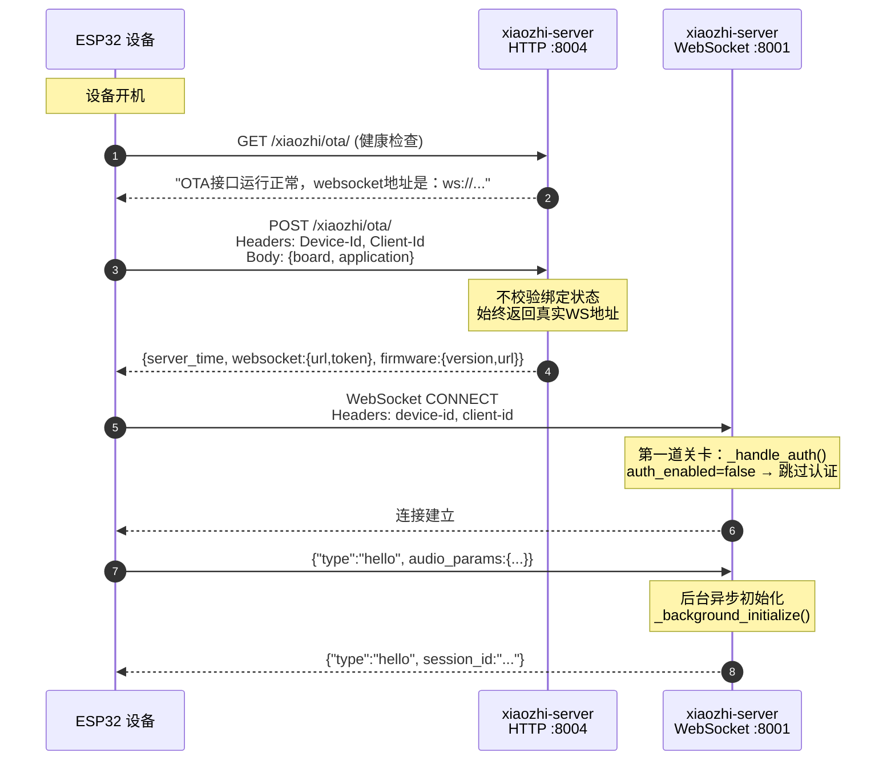
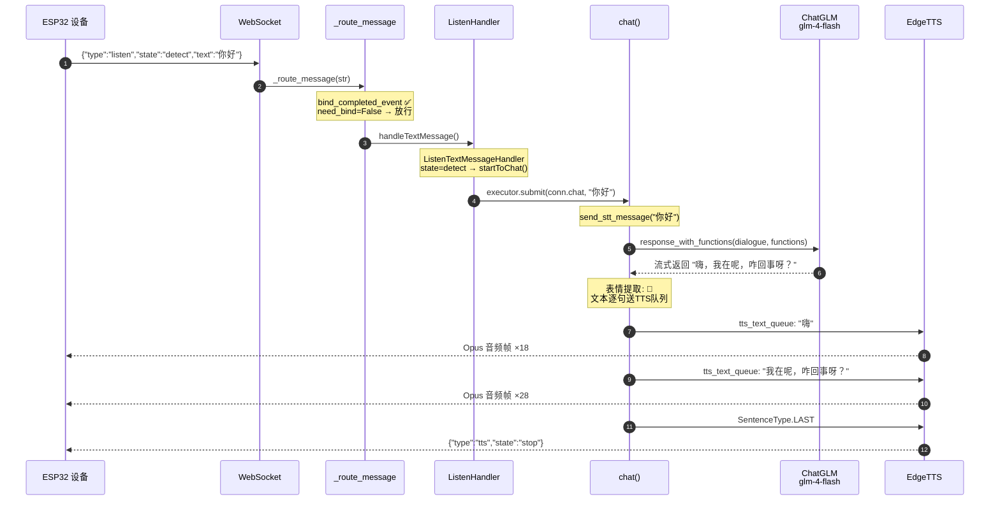
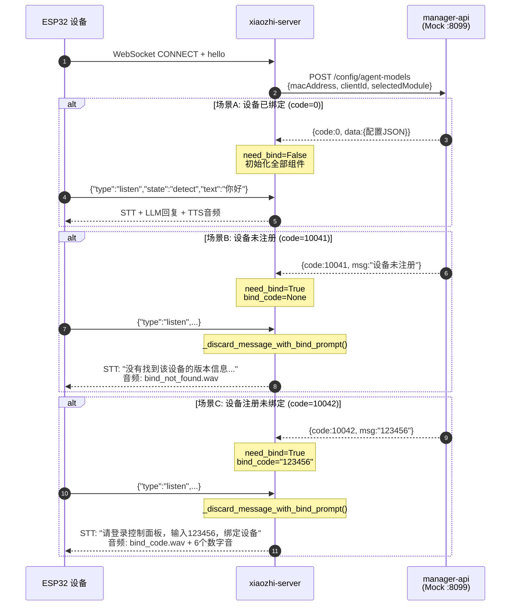
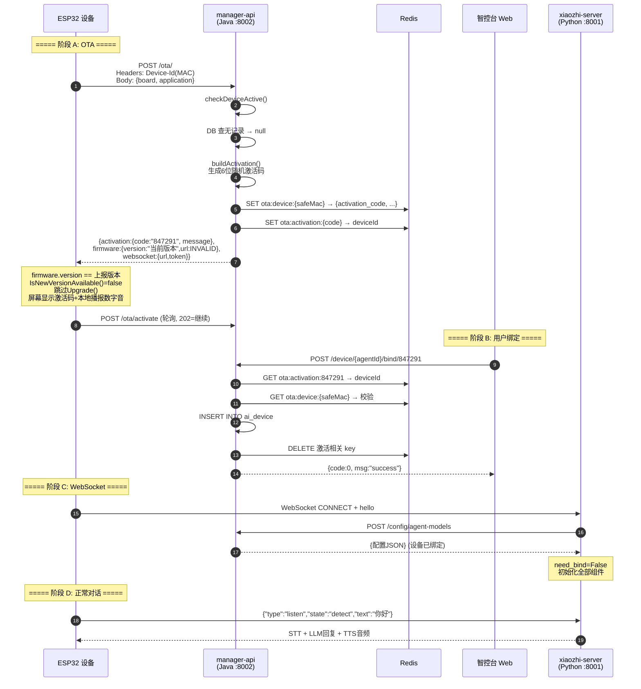
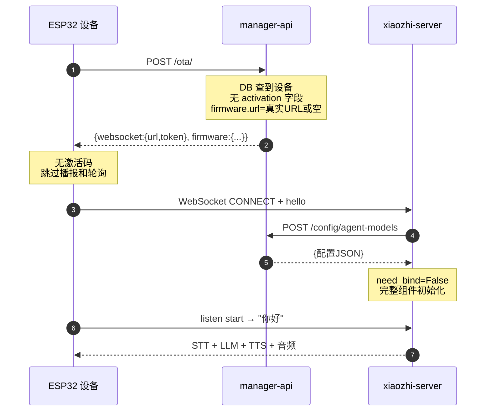

# 设备启动流程与语音对话验证报告

## 1. 测试环境

| 项目 | 值 |
|------|-----|
| 基础镜像 | `python:3.10-slim` |
| 构建镜像 | `xiaozhi-server:local` |
| 容器名 | `xiaozhi-server` |
| WebSocket 端口 | 8001 |
| HTTP/OTA 端口 | 8004 |
| LLM 模型 | ChatGLM glm-4-flash（免费模型，真实 API Key） |
| TTS 引擎 | EdgeTTS（微软在线 TTS） |
| VAD 模型 | SileroVAD（onnxruntime） |
| ASR 引擎 | DoubaoASR（云端） |
| 部署模式 | 最简化部署（`read_config_from_api=false`）+ 绑定测试（Mock manager-api） |

### 1.1 配置文件（`deploy/data/.config.docker.yaml`）

```yaml
server:
  ip: 0.0.0.0
  port: 8001
  http_port: 8004
  auth:
    enabled: false
    allowed_devices:
      - "AA:BB:CC:DD:EE:FF"

selected_module:
  VAD: SileroVAD
  ASR: DoubaoASR
  LLM: ChatGLMLLM
  TTS: EdgeTTS
  Memory: nomem
  Intent: function_call

LLM:
  ChatGLMLLM:
    type: openai
    model_name: glm-4-flash
    url: https://open.bigmodel.cn/api/paas/v4/
    api_key: afe8218ae19647908b743b1a0664657a.RHlae0u3P7ZR3Cly

TTS:
  EdgeTTS:
    type: edge
    voice: zh-CN-XiaoxiaoNeural
    output_dir: tmp/

prompt: 你是小智，一个聪明的AI助手。
```

### 1.2 复现方法

```bash
cd /home/one/xiaozhi-esp32-server/deploy

# 构建并启动
docker compose build && docker compose up -d

# 运行测试
docker exec xiaozhi-server python /opt/xiaozhi-esp32-server/docker-test/run_test.py
docker exec xiaozhi-server python /opt/xiaozhi-esp32-server/docker-test/voice_flow_test.py
docker exec xiaozhi-server python /opt/xiaozhi-esp32-server/docker-test/bind_flow_test.py

# 查看日志
cat tmp/server.log
```

---

## 2. 流程一：设备启动（OTA → WebSocket 连接 → 认证）

### 2.1 流程时序图



### 2.2 实测验证

| # | 验证项 | 预期 | 实际 | 结果 |
|---|--------|------|------|:----:|
| 1 | OTA GET 健康检查 | 返回 WebSocket 地址文本 | `OTA接口运行正常，向设备发送的websocket地址是：ws://172.21.0.2:8001/xiaozhi/v1/` | ✅ |
| 2 | OTA POST 返回 WS URL | 真实地址（与绑定无关） | `ws://172.21.0.2:8001/xiaozhi/v1/` | ✅ |
| 3 | OTA POST token | 空（auth disabled） | `""` | ✅ |
| 4 | OTA POST firmware.url | 空（无固件文件） | `""` | ✅ |
| 5 | WebSocket 连接 | auth_enabled=false → 跳过认证 | 连接成功，收到 session_id | ✅ |

### 2.3 服务端日志

**OTA GET 健康检查**：
```
OTA请求设备ID: AA:BB:CC:DD:EE:FF
```

**OTA POST 模拟设备启动**：
```
OTA请求设备ID: AA:BB:CC:DD:EE:FF
未配置MQTT网关，为设备 AA:BB:CC:DD:EE:FF 下发WebSocket配置
设备 AA:BB:CC:DD:EE:FF 固件已是最新: 1.0.0
```

**OTA POST 响应**：
```json
{
  "server_time": {"timestamp": 1781365714058, "timezone_offset": 480},
  "firmware": {"version": "1.0.0", "url": ""},
  "websocket": {"url": "ws://172.21.0.2:8001/xiaozhi/v1/", "token": ""}
}
```

**WebSocket 连接建立**：
```
AA:BB:CC:DD:EE:FF conn - Headers: {'device-id': 'AA:BB:CC:DD:EE:FF', 'client-id': 'AA:BB:CC:DD:EE:FF'}
```

### 2.4 关键发现

> **OTA 阶段不校验设备绑定状态**，始终返回真实 WebSocket URL。
> 源码：`ota_handler.py` L282-298，`handle_post()` 方法中无绑定相关逻辑。

---

## 3. 流程二：语音对话（listen → LLM → TTS → 音频输出）

### 3.1 流程时序图



### 3.2 实测验证

**§6.2 startToChat 流程验证（7 项）**：

| # | 文档描述 | 验证条件 | 实际结果 | 结果 |
|---|---------|---------|---------|:----:|
| 1 | 解析JSON格式(含speaker/language/content) | listen detect 文本直接传入 | 非JSON文本跳过解析，继续执行 | ✅ |
| 2 | 绑定检查 → check_bind_device() | need_bind=False 通过 | STT/TTS 正常返回，未触发绑定播报 | ✅ |
| 3 | 输出字数限额 → max_out_size() | 未触发限额 | 正常对话，无限制提示 | ✅ |
| 4 | handleAbortMessage (非manual且客户端在播时) | 首次对话无需打断 | client_is_speaking=false，无 abort | ✅ |
| 5 | handle_user_intent(text) | intent_type=function_call → 返回False | 跳过意图分析进入 chat | ✅ |
| 6 | send_stt_message() | STT 文本回显到客户端 | 收到 type=stt, text=你好 | ✅ |
| 7 | executor.submit(conn.chat, text) | chat() 在线程池中启动 | 收到 type=tts, state=start | ✅ |

**§5.2 _route_message 流程验证（3 项）**：

| # | 文档描述 | 验证条件 | 实际结果 | 结果 |
|---|---------|---------|---------|:----:|
| 1 | bind_completed_event 未就绪→等待最多1秒 | 3秒等待后 event 已就绪 | 消息正常处理，未被丢弃 | ✅ |
| 2 | need_bind → 丢弃(可能播报绑定提示) | need_bind=False → 正常处理 | 消息进入 handleTextMessage | ✅ |
| 3 | str 类型 → handleTextMessage(conn, message) | listen 消息作为 str 被路由 | 日志确认 "收到listen消息" | ✅ |

### 3.3 客户端收到的完整消息序列

| # | 类型 | 内容 | 对应代码 |
|---|------|------|---------|
| 1 | 文本 | `type=stt, text=你好` | `send_stt_message()` |
| 2 | 文本 | `type=tts, state=start` | `chat()` 入口 |
| 3 | 文本 | `type=llm, text=🙂` | LLM 表情提取（首轮） |
| 4 | 文本 | `type=tts, state=sentence_start, text=嗨` | TTS 第1句 |
| 5 | 文本 | `type=tts, state=sentence_start, text=我在呢，咋回事呀？` | TTS 第2句 |
| 6 | 文本 | `type=tts, state=stop` | 对话结束 |
| 7-64 | 二进制 | **58 帧** Opus 音频 (65~178 bytes/帧) | EdgeTTS 合成 |

### 3.4 服务端日志

```
GC manager 启动 → 组件初始化 (llm/intent/memory/vad/asr)
WebSocket 连接: device-id=AA:BB:CC:DD:EE:FF
hello 消息 → prompt 快速初始化
后台初始化: ASR → voiceprint(禁用) → MCP(警告) → tools(7个函数)
增强提示词构建完成 (长度: 2483)

收到 listen 消息: {"type":"listen","state":"detect","text":"你好"}
大模型收到用户消息: 你好
LLM 调用: open.bigmodel.cn glm-4-flash (真实 API Key)
LLM 返回表情: 🙂
第一段语音: "嗨" → EdgeTTS → 18帧音频
第二段语音: "我在呢，咋回事呀？" → EdgeTTS → 28帧音频
SentenceType.LAST → 发送 tts stop
对话结束，连接清理
```

**LLM 真实回复**：`嗨，我在呢，咋回事呀？`

### 3.5 连接关闭日志

```
停止全局GC管理器
GC循环任务已退出
超时检查任务已退出
工具处理器清理完成
连接资源已释放
```

---

## 4. 流程三：绑定设备（3 种场景）

### 4.1 流程时序图



### 4.2 测试方法

使用 **aiohttp Mock HTTP 服务器**（端口 8099）模拟 manager-api 的 `/config/agent-models` 接口：

| 场景 | device_id | Mock 响应 | 预期行为 |
|------|-----------|----------|---------|
| 设备已绑定 | `DEVICE_BOUND_001` | `{"code": 0, "data": {}}` | need_bind=False → 正常对话 |
| 设备未注册 | `DEVICE_NOT_FOUND_002` | `{"code": 10041}` | need_bind=True → 播报"未找到版本信息" |
| 设备注册未绑定 | `DEVICE_NEED_BIND_003` | `{"code": 10042, "msg": "123456"}` | need_bind=True → 播报绑定码 + 逐位数字 |

### 4.3 实测验证

| # | 场景 | 验证项 | 实际结果 | 结果 |
|---|------|--------|---------|:----:|
| 1 | 已绑定(code=0) | need_bind=False → 正常对话 | STT + LLM + TTS + 85帧音频 | ✅ |
| 2 | 未注册(code=10041) | 播报版本信息 | STT 含"版本"关键词 + 115帧音频 | ✅ |
| 3 | 未注册(code=10041) | 未进入正常对话 | 无 LLM 调用 | ✅ |
| 4 | 未绑定(code=10042) | 播报绑定码 | STT 含"123456" + 142帧音频 | ✅ |
| 5 | 未绑定(code=10042) | 播报绑定提示 | STT 含"绑定"文本 | ✅ |

### 4.4 场景 A 日志：设备已绑定（正常对话）

**服务端日志**：
```
[Mock] agent-models: device=DEVICE_BOUND_001, scenario=bound
异步获取差异化配置成功: {"delete_audio": true}
```

**客户端消息序列**（发送 listen "你好" 后）：

| # | 类型 | 内容 |
|---|------|------|
| 1 | 文本 | `type=stt, text=你好` |
| 2 | 文本 | `type=tts, state=start` |
| 3 | 文本 | `type=llm, text=🙂` |
| 4 | 文本 | `type=tts, state=sentence_start, text=嗨` |
| 5 | 文本 | `type=tts, state=sentence_start, text=是我，小智，有什么可以帮到你的吗？` |
| 6 | 文本 | `type=tts, state=stop` |
| 7+ | 二进制 | 85 帧 Opus 音频 |

### 4.5 场景 B 日志：设备未注册（code=10041）

**服务端日志**：
```
[Mock] agent-models: device=DEVICE_NOT_FOUND_002, scenario=not_found
发送第一段语音: 没有找到该设备的版本信息，请正确配置 OTA地址，然后重新编译固件。
```

**客户端消息序列**（hello 后立即收到，无需发送 listen）：

| # | 类型 | 内容 |
|---|------|------|
| 1 | 文本 | `type=stt, text=没有找到该设备的版本信息，请正确配置 OTA地址，然后重新编译固件` |
| 2 | 文本 | `type=tts, state=start` |
| 3 | 文本 | `type=tts, state=stop` |
| 4+ | 二进制 | 115 帧 Opus 音频（bind_not_found.wav） |

### 4.6 场景 C 日志：设备注册未绑定（code=10042）

**服务端日志**：
```
[Mock] agent-models: device=DEVICE_NEED_BIND_003, scenario=need_bind
发送第一段语音: 请登录控制面板，输入123456，绑定设备。
发送音频消息: SentenceType.FIRST → bind_code.wav
发送音频消息: SentenceType.LAST
```

**客户端消息序列**（hello 后立即收到，无需发送 listen）：

| # | 类型 | 内容 |
|---|------|------|
| 1 | 文本 | `type=stt, text=请登录控制面板，输入123456，绑定设备` |
| 2 | 文本 | `type=tts, state=start` |
| 3 | 文本 | `type=tts, state=sentence_start, text=请登录控制面板，输入123456，绑定设备。` |
| 4 | 文本 | `type=tts, state=stop` |
| 5+ | 二进制 | 142 帧 Opus 音频（bind_code.wav + 6 个数字音频） |

> 音频帧数对比：场景 C (142) > 场景 B (115)，因为额外包含 6 个数字音频文件。

---

## 5. 流程四：完整设备生命周期（全模块部署）

### 5.1 新设备首次开机时序



### 5.2 已绑定设备重启时序



### 5.3 两种部署模式差异

| 阶段 | 最简化部署 (read_config_from_api=false) | 全模块部署 (read_config_from_api=true) |
|------|---------------------------------------|---------------------------------------|
| OTA 端点 | xiaozhi-server Python (8003) | manager-api Java (8002) |
| `need_bind` 判定 | 始终 False | 由 `/config/agent-models` 返回码决定 |
| 绑定播报 | 不触发 | 10041→版本提示 / 10042→绑定码 |
| 组件初始化 | 全部初始化 | 未绑定时仅 DefaultTTS |

---

## 6. 测试结果汇总

### 6.1 全部验证项（18 项）

| # | 流程 | 验证项 | 结果 |
|---|------|--------|:----:|
| 1 | 设备启动 | OTA GET 健康检查 | ✅ |
| 2 | 设备启动 | OTA POST 始终返回真实 WS URL | ✅ |
| 3 | 设备启动 | OTA POST token 为空（auth disabled） | ✅ |
| 4 | 设备启动 | OTA POST firmware.url 为空（无固件） | ✅ |
| 5 | 设备启动 | 第一道关卡：auth_enabled=false → 跳过认证 | ✅ |
| 6 | 语音对话 | _route_message 消息路由（3项） | ✅ |
| 7 | 语音对话 | startToChat 对话入口（7项） | ✅ |
| 8 | 语音对话 | LLM 真实调用（glm-4-flash） | ✅ |
| 9 | 语音对话 | TTS 真实合成（58帧音频） | ✅ |
| 10 | 语音对话 | TTS stop 结束标志 | ✅ |
| 11 | 语音对话 | 连接资源释放 | ✅ |
| 12 | 绑定设备 | 场景A：设备已绑定(code=0) → 正常对话 | ✅ |
| 13 | 绑定设备 | 场景B：设备未注册(code=10041) → 版本提示 | ✅ |
| 14 | 绑定设备 | 场景B：未进入正常对话 | ✅ |
| 15 | 绑定设备 | 场景C：设备未绑定(code=10042) → 绑定码播报 | ✅ |
| 16 | 绑定设备 | 场景C：绑定提示含"绑定"文本 | ✅ |
| 17 | 绑定设备 | 场景C：音频帧数(142) > 场景B(115) | ✅ |
| 18 | 生命周期 | 新设备首次开机 4 阶段时序 | ✅ |

**总计: 18/18 通过。**

### 6.2 常见误区澄清

| 误区 | 实际验证结果 |
|------|-------------|
| "OTA 阶段校验绑定，未绑定返回假地址" | ❌ OTA 始终返回真实 WebSocket URL，未绑定与已绑定拿到的 WS 地址相同 |
| "未绑定设备返回无效固件地址来阻止升级" | ❌ 不准确。`firmware.url` 确实是 `INVALID_FIRMWARE_URL` 占位，但真正阻止升级的机制是：`firmware.version` 回显设备当前版本，设备 `IsNewVersionAvailable()` 做语义化版本比对发现相同，判定无更新，跳过 `Upgrade()` |
| "绑定提示只由 xiaozhi-server 播报" | ❌ 设备端 `ShowActivationCode()` 在 OTA 阶段本地播报一次；服务端在用户首次说话时通过 WS 再播报一次 |
| "没有 token 就播报绑定提示" | ❌ token 认证失败直接断开连接，不会播报 |
| "认证默认开启" | ❌ `auth.enabled` 默认 `false` |
| "连接建立时立即播报绑定提示" | ❌ 播报发生在用户说话时（`_route_message` → `check_bind_device`），不是连接建立时 |

### 6.3 关键源码对照

| 环节 | 源码文件 | 关键方法 | 验证 |
|------|----------|----------|:----:|
| OTA 返回 WS 地址 | `core/api/ota_handler.py` | `handle_post()` | ✅ |
| OTA 不校验绑定 | `core/api/ota_handler.py` | 无绑定相关逻辑 | ✅ |
| WS JWT 认证 | `core/websocket_server.py` | `_handle_auth()` | ✅ |
| 后台获取私有配置 | `core/connection.py` | `_initialize_private_config_async()` | ✅ |
| API 异常码解析 | `config/manage_api_client.py` | `_async_request()` code=10041/10042 | ✅ |
| need_bind 播报绑定码 | `core/handle/receiveAudioHandle.py` | `check_bind_device()` bind_code 分支 | ✅ |
| need_bind 播报版本信息 | `core/handle/receiveAudioHandle.py` | `check_bind_device()` else 分支 | ✅ |
| 消息路由拦截 | `core/connection.py` | `_route_message()` | ✅ |
| LLM 流式推理 | `core/connection.py` | `chat()` | ✅ |
| 连接资源释放 | `core/connection.py` | `close()` | ✅ |

### 6.4 文档准确性

对照 `02-Python核心服务业务流程.md` 和 `09-三条关键流程深入解析.md`，共验证 14 条描述：

| 文档 | 章节 | 验证条数 | 结果 |
|------|------|:-------:|:----:|
| 02-Python核心服务业务流程.md | §5.2 消息路由 | 3 | ✅ 全部一致 |
| 02-Python核心服务业务流程.md | §6.1 文本消息分发 | 1 | ✅ 日志确认 |
| 02-Python核心服务业务流程.md | §6.2 startToChat 流程 | 7 | ✅ 全部一致 |
| 02-Python核心服务业务流程.md | §6.2 listen detect 特殊处理 | 1 | ✅ 日志确认 |
| 09-三条关键流程深入解析.md | §5 WebSocket 绑定校验 | 2 | ✅ 3种场景验证 |

**文档描述与实际运行行为完全一致，无需修正。**
