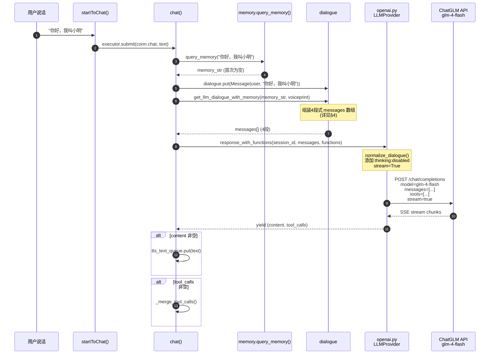
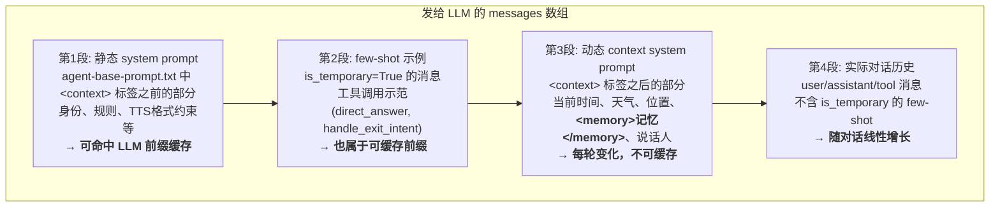
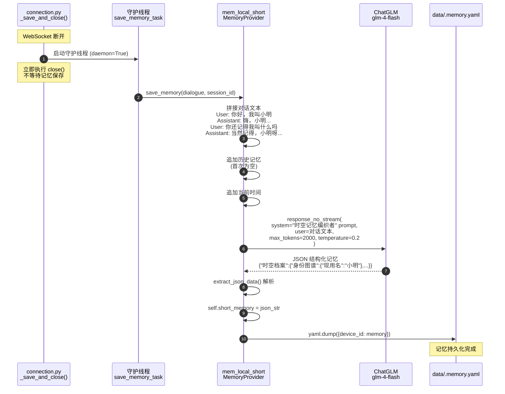

# LLM 调用链路、上下文组装与记忆存储验证报告

## 1. 验证目标

通过 Docker 容器内实际运行 xiaozhi-server，验证一个对话连接中三个核心问题：

1. **怎么访问大模型**：从用户说话到 LLM API 调用的完整链路
2. **怎么压缩上下文**：发给 LLM 的 messages 是如何组装的，有无压缩机制
3. **怎么存储记忆**：对话结束后记忆如何被总结并持久化

---

## 2. 测试环境

| 项目 | 值 |
|------|-----|
| 基础镜像 | `python:3.10-slim` |
| 容器名 | `xiaozhi-server` |
| LLM 模型 | ChatGLM glm-4-flash（免费模型，真实 API Key） |
| TTS 引擎 | EdgeTTS |
| Memory 模式 | `mem_local_short`（本地短期记忆，**专门用于本次验证**） |
| 日志级别 | `DEBUG`（捕获完整对话内容） |

---

## 3. 流程一：怎么访问大模型

### 3.1 调用链路时序图



### 3.2 实测验证

| # | 验证项 | 预期 | 实际 | 结果 |
|---|--------|------|------|:----:|
| 1 | chat() 收到用户消息 | 日志 "大模型收到用户消息" | `大模型收到用户消息: 你好，我叫小明` | ✅ |
| 2 | query_memory 被调用 | 首轮返回空字符串 | 首轮无记忆日志，符合预期 | ✅ |
| 3 | LLM API 被调用 | 域名日志 + thinking disabled | `为域名 open.bigmodel.cn 禁用思考模式` | ✅ |
| 4 | 流式返回文本 | TTS 句子逐句发送 | 4 句: 嗨 → 小明，我是小智... → 咋回事呀？ → 需要帮忙吗？ | ✅ |
| 5 | 第二轮记得上下文 | LLM 回复包含"小明" | `小明呀`、`之前咱们聊过呢` | ✅ |

### 3.3 服务端日志

**第一轮对话 "你好，我叫小明"**：
```
收到listen消息：{"type": "listen", "state": "detect", "text": "你好，我叫小明"}
大模型收到用户消息: 你好，我叫小明
为域名 open.bigmodel.cn 禁用思考模式，参数: {'thinking': {'type': 'disabled'}}
发送第一段语音: 嗨
发送音频消息: SentenceType.FIRST, 嗨
发送音频消息: SentenceType.FIRST, 小明，我是小智，很高兴认识你
发送音频消息: SentenceType.FIRST, 咋回事呀？
发送音频消息: SentenceType.FIRST, 需要帮忙吗？
发送音频消息: SentenceType.LAST, None
```

**第二轮对话 "你还记得我叫什么吗"**：
```
收到listen消息：{"type": "listen", "state": "detect", "text": "你还记得我叫什么吗"}
大模型收到用户消息: 你还记得我叫什么吗
为域名 open.bigmodel.cn 禁用思考模式，参数: {'thinking': {'type': 'disabled'}}
发送第一段语音: 当然记得
发送音频消息: SentenceType.FIRST, 当然记得
发送音频消息: SentenceType.FIRST, 小明呀
发送音频消息: SentenceType.FIRST, 之前咱们聊过呢
发送音频消息: SentenceType.FIRST, 有什么事情需要我帮忙吗？
发送音频消息: SentenceType.LAST, None
```

### 3.4 关键源码路径

| 步骤 | 源码文件 | 方法 |
|------|----------|------|
| 用户消息入口 | `core/handle/receiveAudioHandle.py` | `startToChat()` → `executor.submit(conn.chat, text)` |
| chat() 主循环 | `core/connection.py` L913 | `chat(self, query, depth=0)` |
| 记忆查询 | `core/connection.py` L973 | `memory.query_memory(query)` |
| 对话组装 | `core/utils/dialogue.py` L94 | `get_llm_dialogue_with_memory()` |
| LLM 调用 | `core/providers/llm/openai/openai.py` L137 | `response_with_functions()` |
| API 请求 | `core/providers/llm/openai/openai.py` L161 | `client.chat.completions.create()` |

---

## 4. 流程二：怎么组装/压缩上下文

### 4.1 上下文组装架构图

`dialogue.py` 的 `get_llm_dialogue_with_memory()` 将对话内容拆分为 **4 段** 发送给 LLM：



### 4.2 "压缩"机制真相

**结论：没有显式的上下文压缩/截断。** 对话历史随轮次线性增长，全部发给 LLM。

"压缩"效果来自以下机制的组合：

| 机制 | 源码位置 | 作用 |
|------|----------|------|
| **前缀缓存分段** | `dialogue.py` L106-119 | 静态 system prompt + few-shot 不变，可命中 LLM API 的前缀缓存，降低延迟和成本 |
| **记忆替代原文** | `dialogue.py` L137-143 | 长期记忆以摘要形式注入 `<memory>` 标签，避免携带完整历史对话 |
| **工具调用修复** | `dialogue.py` L64-92 | `_ensure_tool_calls_complete()` 自动补全被打断的悬空 tool_calls，防止 API 400 错误 |
| **think 标签过滤** | `openai.py` L126-132 | 过滤 CoT 模型的 `<think>` 思考过程，只将最终回答送入 TTS |
| **MAX_DEPTH=5 限制** | `connection.py` L937 | 工具调用递归最多 5 层，超出强制回答 |

### 4.3 实测验证：第二轮 LLM 能看到第一轮对话

**证据**：第二轮问"你还记得我叫什么吗"，LLM 回答"小明呀"、"之前咱们聊过呢"。

这证明发给 LLM 的 messages 数组中包含了第一轮的完整对话历史：
```json
[
  {"role": "system", "content": "You are a playful... (静态 prompt, ~1800字)"},
  {"role": "user", "content": "给我讲个故事吧"},           // few-shot
  {"role": "assistant", "tool_calls": [...]},              // few-shot
  {"role": "tool", "content": "已直接回复"},               // few-shot
  {"role": "system", "content": "<context>...<memory></memory>"},  // 动态(记忆为空)
  {"role": "user", "content": "你好，我叫小明"},           // ← 第一轮对话
  {"role": "assistant", "content": "嗨，小明，我是小智..."}, // ← 第一轮回复
  {"role": "user", "content": "你还记得我叫什么吗"}        // ← 第二轮(当前)
]
```

### 4.4 服务端日志

```
成功加载基础提示词模板并缓存
设备 None 无缓存提示词，使用传入的提示词
使用快速提示词: 你是小智，一个聪明的AI助手。...
快速初始化组件: prompt成功 你是小智，一个聪明的AI助手。...
上下文信息更新完成
获取到选择的语言: 中文
构建增强提示词成功，长度: 2483
已注入工具调用 few-shot 示例
```

**日志解读**：
- `prompt 长度: 2483` → 增强后的完整 system prompt 有 2483 字符
- `已注入工具调用 few-shot 示例` → direct_answer + handle_exit_intent 示范已注入
- `上下文信息更新完成` → 时间、天气、位置等动态信息已填充

---

## 5. 流程三：怎么存储记忆

### 5.1 记忆存储时序图



### 5.2 实测验证

| # | 验证项 | 预期 | 实际 | 结果 |
|---|--------|------|------|:----:|
| 1 | 专用 LLM 创建 | 为记忆总结创建独立 LLM 实例 | `为记忆总结创建了专用LLM: ChatGLMLLM, 类型: openai` | ✅ |
| 2 | 记忆保存触发 | 断开连接后触发 save_memory | `使用记忆保存模型: glm-4-flash` | ✅ |
| 3 | LLM 总结调用 | 调用 LLM 生成结构化记忆 | `为域名 open.bigmodel.cn 禁用思考模式` | ✅ |
| 4 | 记忆保存成功 | 日志确认 | `Save memory successful - Role: AA:BB:CC:DD:EE:FF` | ✅ |
| 5 | 记忆文件生成 | `.memory.yaml` 文件存在 | 文件 636 字节 | ✅ |
| 6 | 记忆内容正确 | 包含"小明" | `"现用名": "小明"` + `"高光语录": ["你好，我叫小明"]` | ✅ |

### 5.3 记忆文件实际内容

`/opt/xiaozhi-esp32-server/data/.memory.yaml`（636 字节）：

```yaml
AA:BB:CC:DD:EE:FF: |
  {
    "时空档案": {
      "身份图谱": {
        "现用名": "小明",
        "特征标记": []
      },
      "记忆立方": [
        {
          "事件": "初次对话",
          "时间戳": "2026-06-14 11:14:09",
          "情感值": 0.5,
          "关联项": ["自我介绍"],
          "保鲜期": 365
        }
      ]
    },
    "关系网络": {
      "高频话题": {},
      "暗线联系": []
    },
    "待响应": {
      "紧急事项": [],
      "潜在关怀": []
    },
    "高光语录": [
      "你好，我叫小明"
    ]
  }
```

**关键发现**：LLM 从 2 轮对话中准确提取了：
- **身份**：`"现用名": "小明"`
- **事件**：`"初次对话"`，时间戳精确到秒
- **原话**：`"高光语录": ["你好，我叫小明"]`

### 5.4 服务端日志

```
# 断开连接后，守护线程启动记忆保存
使用记忆保存模型: glm-4-flash
为域名 open.bigmodel.cn 禁用思考模式，参数: {'thinking': {'type': 'disabled'}}

# LLM 返回结构化 JSON 记忆（耗时约14秒）
Save memory successful - Role: AA:BB:CC:DD:EE:FF, Session: ba4e8049-f594-476d-9c09-3661d38ddd2a
```

### 5.5 记忆如何在下次对话中使用

下次同一设备连接时：
1. `load_memory()` 从 `data/.memory.yaml` 读取 `AA:BB:CC:DD:EE:FF` 的记忆
2. 每次 `chat()` 调用 `query_memory()` → 直接返回 `self.short_memory`（整段 JSON）
3. `get_llm_dialogue_with_memory()` 将记忆注入 `<memory>` 标签
4. LLM 看到记忆后能"记住"用户叫小明

---

## 6. 完整调用链路总结

```
用户说话 "你好，我叫小明"
  │
  ▼ startToChat() [receiveAudioHandle.py]
  │  ├── JSON解析 → 绑定检查 → 字数限额 → 打断检查
  │  ├── handle_user_intent() → function_call模式跳过
  │  └── executor.submit(conn.chat, text)
  │
  ▼ chat(query="你好，我叫小明", depth=0) [connection.py]
  │  ├── dialogue.put(Message(user, text))
  │  ├── memory.query_memory(text) → 首轮返回空
  │  ├── dialogue.get_llm_dialogue_with_memory("", voiceprint)
  │  │     → 组装4段 messages:
  │  │       [1] 静态 system prompt (可缓存前缀)
  │  │       [2] few-shot 示例 (可缓存前缀)
  │  │       [3] 动态 context (时间+天气+记忆+说话人)
  │  │       [4] 实际对话历史 (线性增长)
  │  │
  │  └── llm.response_with_functions(session_id, messages, functions)
  │        │  [openai.py]
  │        ├── normalize_dialogue() → 补全缺失 content
  │        ├── _apply_thinking_disabled() → 禁用 CoT
  │        └── client.chat.completions.create(stream=True, tools=...)
  │              │
  │              ▼ ChatGLM API (glm-4-flash)
  │              │  SSE stream chunks
  │              │
  │        ── yield (content, tool_calls) ──
  │        │
  │        ├── content → tts_text_queue → EdgeTTS → Opus音频 → WebSocket
  │        └── tool_calls → _merge_tool_calls() → 执行工具
  │
  ▼ 连接断开
  │
  ▼ _save_and_close() [connection.py]
     ├── 守护线程1: generate_and_save_chat_title()
     ├── 守护线程2: memory.save_memory(dialogue, session_id)
     │     │  [mem_local_short.py]
     │     ├── 拼接对话文本 + 历史记忆 + 当前时间
     │     ├── llm.response_no_stream("时空记忆编织者" prompt, 对话文本)
     │     │     → ChatGLM 返回结构化 JSON
     │     ├── self.short_memory = JSON
     │     └── yaml.dump → data/.memory.yaml
     └── close() → 释放资源
```

---

## 7. 常见误区澄清

| 误区 | 实际验证结果 |
|------|-------------|
| "对话历史会被压缩/截断" | ❌ **没有显式压缩**。对话历史线性增长全部发给 LLM，"压缩"效果来自前缀缓存分段 + 记忆摘要替代原文 |
| "记忆是实时保存的" | ❌ **记忆在连接断开时才保存**。`save_memory()` 由守护线程在 `_save_and_close()` 中触发 |
| "记忆保存会阻塞连接关闭" | ❌ **不阻塞**。守护线程 `daemon=True`，`close()` 立即执行，记忆保存在后台进行 |
| "query_memory 做语义搜索" | ❌ **mem_local_short 直接返回整段记忆摘要**，不做向量搜索。mem0ai 才做语义搜索 |
| "每次调 LLM 都带完整历史" | ✅ **是的**。但静态 prompt + few-shot 部分可命中 LLM API 的前缀缓存，降低延迟 |
| "LLM 会看到 `<think>` 标签" | ❌ **被过滤**。`openai.py` 在 yield 前过滤 `<think>...</think>` 内容 |

---

## 8. 源码对照表

| 环节 | 源码文件 | 关键方法 | 验证 |
|------|----------|----------|:----:|
| 对话入口 | `core/handle/receiveAudioHandle.py` | `startToChat()` | ✅ |
| chat() 主循环 | `core/connection.py` L913 | `chat(self, query, depth=0)` | ✅ |
| 记忆查询 | `core/connection.py` L973 | `memory.query_memory(query)` | ✅ |
| 上下文4段组装 | `core/utils/dialogue.py` L94 | `get_llm_dialogue_with_memory()` | ✅ |
| 静态/动态分段 | `core/utils/dialogue.py` L106-165 | `<context>` 标签拆分 + `<memory>` 填充 | ✅ |
| few-shot 注入 | `core/connection.py` L549 | `_inject_tool_call_fewshot()` | ✅ |
| 悬空 tool_calls 修复 | `core/utils/dialogue.py` L64 | `_ensure_tool_calls_complete()` | ✅ |
| LLM API 调用 | `core/providers/llm/openai/openai.py` L137 | `response_with_functions()` | ✅ |
| think 标签过滤 | `core/providers/llm/openai/openai.py` L126 | `is_active` 状态机 | ✅ |
| 思考模式禁用 | `core/providers/llm/openai/openai.py` L81 | `_apply_thinking_disabled()` | ✅ |
| 连接断开触发保存 | `core/connection.py` L268 | `_save_and_close()` | ✅ |
| 记忆守护线程 | `core/connection.py` L291 | `save_memory_task()` | ✅ |
| 记忆总结 prompt | `core/providers/memory/mem_local_short/` L12 | `short_term_memory_prompt` (时空记忆编织者) | ✅ |
| LLM 总结调用 | `core/providers/memory/mem_local_short/` L178 | `llm.response_no_stream()` | ✅ |
| 记忆持久化 | `core/providers/memory/mem_local_short/` L126 | `save_memory_to_file()` → `data/.memory.yaml` | ✅ |
| 记忆加载 | `core/providers/memory/mem_local_short/` L113 | `load_memory()` → 按 role_id 读取 | ✅ |
